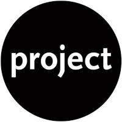

<p align="center">
  
</p>

## Interview Tool


[](https://www.codefactor.io/repository/github/frankeo/interview-tool)

[](https://dependabot.com)

<!-- ALL-CONTRIBUTORS-BADGE:START - Do not remove or modify this section -->

[](#contributors-)

<!-- ALL-CONTRIBUTORS-BADGE:END -->

---

<p align="center">
This repo contains a CLI tool for create, save and deploy exercises for
interviews.
</p>

## :pencil: Table of Contents

- [About](https://github.com/Frankeo/interview-challenges#-about)
- [Getting Started](https://github.com/Frankeo/interview-challenges#-getting_started)
- [Usage](https://github.com/Frankeo/interview-challenges#-usage)
- [Deployment](https://github.com/Frankeo/interview-challenges#-deployment)
- [Built Using](https://github.com/Frankeo/interview-challenges#-built_using)
- [New Features](https://github.com/Frankeo/interview-challenges#-todos)
- [Authors](https://github.com/Frankeo/interview-challenges#-authors)

## :mag: About

The main idea is to have a collection of easy to extract **interview code
challenges** and being able to deploy them into
[codesandbox](https://codesandbox.io).

The **CLI (interview-tool)** let you create a new project with the next
[scaffolding](), so you don't start form scratch!

Also, let you add/save already started projects to your interview list,
following this [criteria]().

All the projects into your **interview list** are able to be deploy! you have
multiple [criteria selection](), even a random one for avoiding favoritism
problems! 😎

## :checkered_flag: Getting Started

### Prerequisites

For using this CLI, needs to be installed:


### Installation

Only need to run

```
npm install -g interview-tool
```

And that's it!! 🥳

### Debugging

- 1º Download the project and install the packages inside the project folder

```
cd interview-challenges/
npm i
```

- 2º Inside the project folder you need to create a **linksymb** to be able to
  run the tool globally

```
npm link
```

- 3º Go to another location (one folder back is enough!) and check if the
  command **interview-tool** is available.

- 4º **That's all!** Your code changes are going to take effect over the
  commands executed by the tool! 🤓

## :balloon: Usage

For a more [detailed documentation and examples]()

```
interview-tool <command>
```

- `add <folderName>`: Name of the folder containing the repo that you want to
  upload.

- `list`: Get all the exercises available

- `create <projectName>`: Create a new project folder to work in locally.

- `deploy [-p] [-t] [-d] [noTests]`: Deploy to CodeSandbox by projectName, Topic
  or Difficulty

- `completion`: Follow the instructions to get autocompletion CLI tool.

## :rocket: Deployment

Github Actions for creating a [npm](https://www.npm.org) package


## :pick: Built Using

- [NodeJs](https://nodejs.org/en/) - Server Environment
- [Yargs](http://yargs.js.org/) - Command Parser
- [CodeSandbox](https://codesandbox.io) - Exercise release environment
- [SQLite](https://www.sqlite.org/index.html) - Local exercise DB

## :crossed_fingers: New Features

:heavy_check_mark: Adding more unit testing.

:white_large_square: Manual Testing on Windows.

:white_large_square: Manual Testing on Linux (Ubuntu and Debian).

:heavy_check_mark: Adding better log information.

:white_large_square: Adding support for generate document on readme (to PDF
format) in every internal project.

:heavy_check_mark: Check project status before saving.

:white_large_square: Avoid adding duplicated projects

:heavy_check_mark: Setting **Dependabot** for the project.

:white_large_square: Create Integration test for avoid repeat manual testing
over different OS.

:white_large_square: Install **Eslint** and define Standard.

:heavy_check_mark: Define **License** for the project.

:white_large_square: Add multiple projects in batch when contained in the same
folder.

:white_large_square: Install **Husky** for prepush and avoid upload wrong code.

:white_large_square: Adding **Changelog** tracking in user documentation.

:white_large_square: Track Analytics usage of the CLI.

:white_large_square: Create Github Page for user Documentation.

:white_large_square: Create Wiki for developer easy rampage.

## :writing_hand: Authors

- [Francisco Moreno](https://github.com/Frankeo) - Idea & Initial work

## Contributors ✨

Thanks goes to these wonderful people
([emoji key](https://allcontributors.org/docs/en/emoji-key)):

<!-- ALL-CONTRIBUTORS-LIST:START - Do not remove or modify this section -->
<!-- prettier-ignore-start -->
<!-- markdownlint-disable -->
<table>
  <tr>
    <td align="center"><a href="https://tnovau.github.io"><br /><sub><b>Tomás Novau</b></sub></a><br /><a href="https://github.com/Frankeo/interview-challenges/pulls?q=is%3Apr+reviewed-by%3Atnovau" title="Reviewed Pull Requests">👀</a></td>
  </tr>
</table>

<!-- markdownlint-enable -->
<!-- prettier-ignore-end -->

<!-- ALL-CONTRIBUTORS-LIST:END -->

This project follows the
[all-contributors](https://github.com/all-contributors/all-contributors)
specification. Contributions of any kind welcome!
